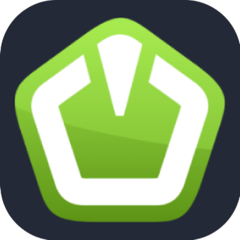

<h1 align="center">Hi there 👋, I'm Muhammad Hasaam</h1>

  

  

<!--

  

-->

---

### 👨‍💻 About Me
- 🎓 CS enthusiast focused on **problem solving** and **full-stack web development**
- 💻 Skilled in **C++**, **Python**, **MERN stack**, and **modern web tools**
- ⚡ Learning **Next.js**, **TailwindCSS**, **EJS**, and backend APIs
- 🧠 Actively practicing on [LeetCode](https://leetcode.com/u/M_HASAAM/)
- 🚀 Always open to collaboration and innovative ideas!

---

### 🚀 Tech Stack

---

#### 🖥 Programming & Game Dev

---

#### 🌐 Web Technologies

---

#### ⚛ Frameworks & Libraries (MERN)

---

#### ☁ Databases & Cloud

---

#### 🛠 Tools & Platforms

---

### 🧠 LeetCode Practice
📊 Visit my profile → [leetcode.com/u/M_HASAAM](https://leetcode.com/u/M_HASAAM/)

---

### 📈 GitHub Activity & Stats

<!-- GitHub Streak Stats -->

<!-- GitHub Stats -->

<!-- Top Languages -->

<!-- GitHub Contribution Graph -->

---

### 🔗 Let's Connect

- 🌐 **Portfolio**: [m-hasaam.github.io/M-Hasaam](https://m-hasaam.github.io/M-Hasaam/)
- 💼 **LinkedIn**: [m-hasaam](https://pk.linkedin.com/in/m-hasaam)
- ✉️ **Email**: m.hasaam.official@gmail.com

---

> “Code is like humor. When you have to explain it, it’s bad.” – Cory House
